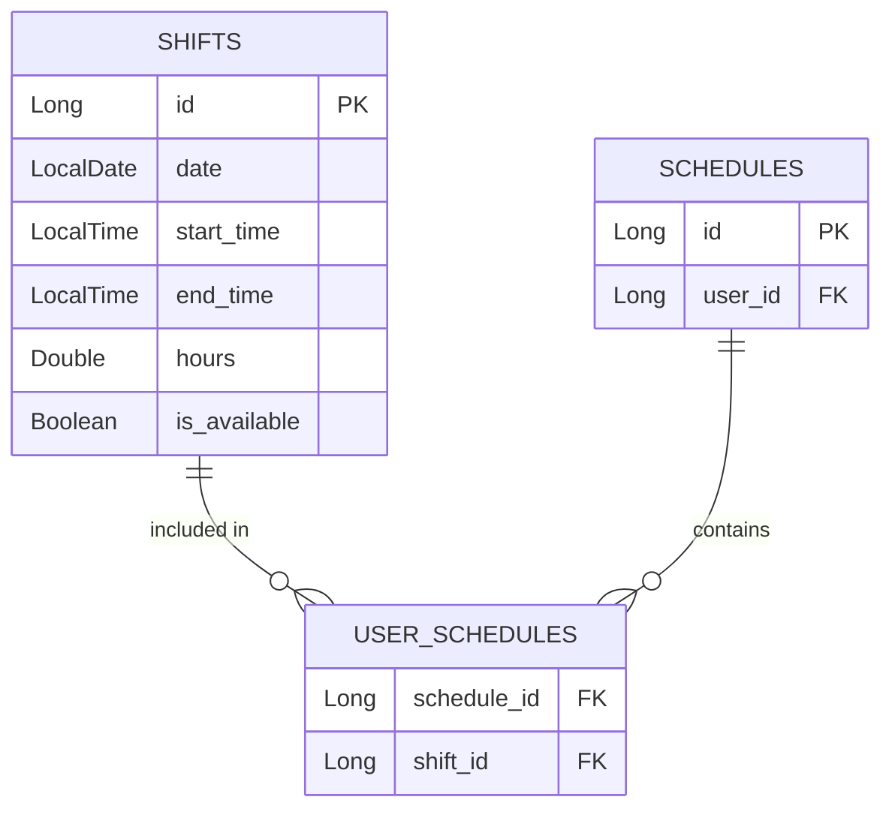

<div align="center">

<h1 align="center">
  
</h1>

<p align="center">
  A full-stack web application for workforce schedule management with dynamic shift filtering and real-time conflict detection.
</p>

<!-- TECH BADGES -->


<br />

<!-- QUICK NAVIGATION LINKS -->
<p align="center">
  <a href="#about-the-project">About</a> •
  <a href="#key-features">Features</a> •
  <a href="#application-demo">Key Visuals</a> •
  <a href="#database-architecture">Database</a> •
  <a href="#api-endpoints">API</a> •
  <a href="#local-setup">Installation</a>
</p>

</div>

---

## 

This is a **full-stack web application** designed and built as a capstone project for LaunchCode. **Shift Planner** addresses workforce scheduling challenges by providing employees and managers with a clean interface to view open shifts, claim work hours, and manage schedules in real time.

The application features a responsive React frontend paired with a Java Spring Boot backend and MySQL database. Built-in business logic prevents scheduling overlaps and detects shift conflicts dynamically before saving data.

---

## 

* 🔍 **Smart Filtering:** Instant filtering by time categories (*Morning*, *Afternoon*, *Evening*) and specific days of the week.
* ⚠️ **Conflict Detection:** Validation logic ensuring zero overlapping work schedules when claiming shifts.
* ⚡ **Responsive UI State:** Dynamic rendering updates across React components without full page reloads.
* 🛠️ **RESTful API Integration:** Seamless endpoints bridging the React frontend and Spring Boot / Data JPA backend.

---

## 

<div align="center">

<span style="color: #ffffff; background-color: #007ACC; padding: 5px 12px; border-radius: 4px; font-weight: bold;">Available Shifts & Dynamic Filtering</span>  
<br />


<br /><br />

<span style="color: #ffffff; background-color: #28A745; padding: 5px 12px; border-radius: 4px; font-weight: bold;">Shift Selection & Conflict Alert</span>
<br />


</div>

---

## 

The system models a **Many-to-Many (`@ManyToMany`)** relationship between `Shift` and `Schedule` entities. This design allows master shift slots to exist in a shared pool and be assigned to multiple user schedules without duplicating database rows.


---
## 

<details>
<summary><b>Click to expand Shift Endpoints (<code>/shifts</code>)</b></summary>

  <br />


| Method | Endpoint | Description |
| :--- | :--- | :--- |
| `GET` | `/shifts` | Fetch all active shifts (supports optional `type` and `day` parameters) |
| `POST` | `/shifts` | Create a new master shift slot |
| `DELETE` | `/shifts/{shiftId}` | Remove a shift slot by ID |

</details>

<br />

<details>
<summary><b>Click to expand Schedule Endpoints (<code>/schedules</code>)</b></summary>

<br />

| Method | Endpoint | Description |
| :--- | :--- | :--- |
| `GET` | `/schedules/users/{userId}` | Get confirmed schedule and assigned shifts for a user |
| `POST` | `/schedules/users/{userId}/shifts/{shiftId}` | Claim and assign a shift to a user schedule |
| `DELETE` | `/schedules/users/{userId}/shifts/{shiftId}` | Drop a shift from a user schedule |

</details>

---

## 

### 📋 Prerequisites
* JDK 17 or higher
* Node.js (v18+) & npm
* MySQL Server running locally on port `3306`

### 🗄️ 1. Database Configuration
Open MySQL Workbench and execute:
```sql
CREATE DATABASE shift_planner_db;
```
### ☕ 2. Backend Setup
 Clone the repository and navigate to the backend directory:
   ```bash
   git clone [https://github.com/lakshmipcherukula-arch/ShiftPlanner.git](https://github.com/lakshmipcherukula-arch/ShiftPlanner.git)
   cd ShiftPlanner/shift-planner-backend

1.Create an .env file in the root backend directory:

Code snippet
SPRING_DATASOURCE_URL=jdbc:mysql://localhost:3306/shift_planner_db
SPRING_DATASOURCE_USERNAME=root
SPRING_DATASOURCE_PASSWORD=your_mysql_password

2.Run the Spring Boot application:
./mvnw spring-boot:run
```
### ⚛️ 3. Frontend Setup

1. Open a new terminal and navigate to the frontend directory:
cd ShiftPlanner/shift-planner-frontend
2. Install dependencies and start the Vite development server:
npm install
npm run dev
3. Open http://localhost:5173 in your browser.
   

Lakshmi Prasanna Cherukula

GitHub: @lakshmipcherukula-arch

  
